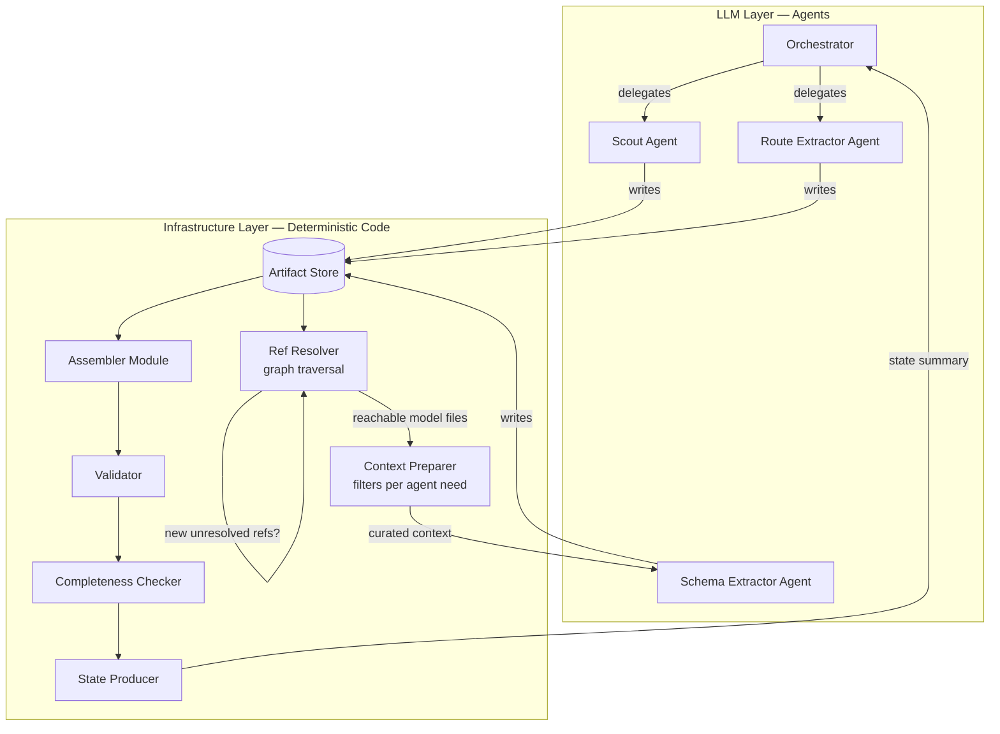
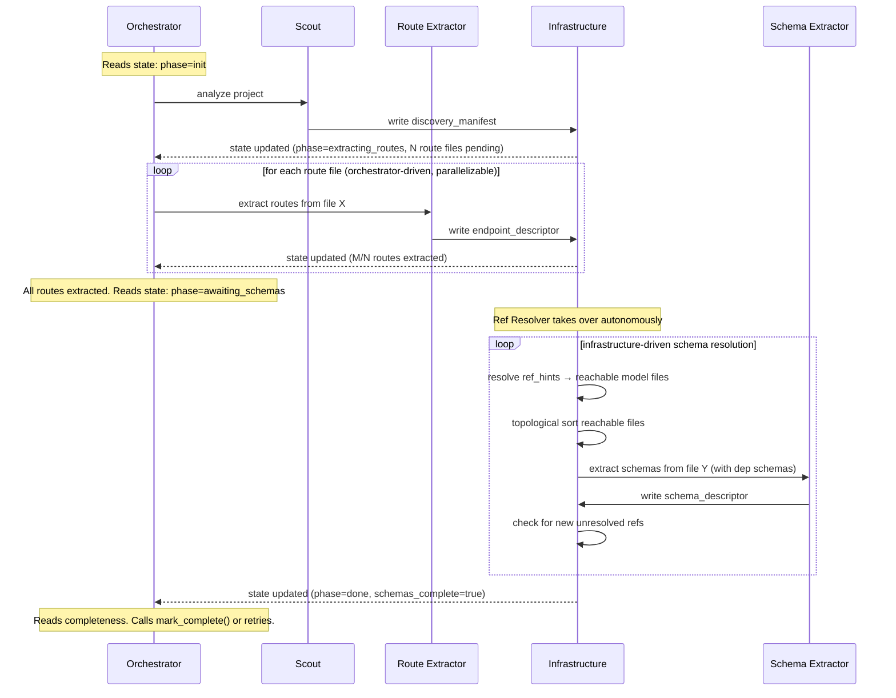

# Swagger Agent

## What This Is

A multi-agent system that generates OpenAPI 3.0 specifications from arbitrary codebases. The output must be complete enough for a penetration tester to use as an attack surface map.

## System Boundary: Agents vs. Infrastructure

There are two distinct layers in this system. Never mix them.

**Agents** (LLM-powered) extract information from source code. They read files, interpret code, and produce structured JSON artifacts. They never build YAML, never validate specs, never decide if the spec is complete, never resolve references between artifacts.

**Infrastructure** (deterministic code) manages the artifact store, resolves ref chains, triggers schema extraction, assembles artifacts into OpenAPI YAML, validates the spec, evaluates completeness, and produces the state summary the orchestrator reads. It never interprets source code.



## Agents

There are exactly **3 worker agents + 1 orchestrator**. Do not add more agents. Do not collapse agents together.

### Orchestrator

Reads the state summary and decides what to do next. It only drives **route extraction** — deciding which route files to extract and in what order. It does not drive schema extraction; that is handled autonomously by infrastructure after routes are complete.

The orchestrator has two tools:

| Tool | Purpose |
|------|---------|
| `delegate(agent, task_id)` | Send work to a worker agent |
| `mark_complete()` | Signal that the spec is done |

The orchestrator sees only a state summary injected by infrastructure. It never reads source files, artifacts, or full validation output. It cannot set `schemas_complete` — that flag is controlled by infrastructure.

**State summary the orchestrator reads:**

```json
{
  "phase": "extracting_routes | awaiting_schemas | done",
  "framework": "fastapi",
  "routes": {
    "total": 5,
    "extracted": 3,
    "pending": ["comments.py", "tags.py"]
  },
  "schemas_complete": false,
  "completeness": {
    "has_endpoints": true,
    "has_security_schemes": true,
    "endpoints_have_auth": true,
    "has_error_responses": true,
    "has_request_bodies": true,
    "has_schemas": false,
    "no_unresolved_refs": false,
    "has_servers": true,
    "route_coverage": 0.6
  },
  "validation_errors_summary": "2 errors: missing $ref CommentResponse, duplicate operationId",
  "retry_count": 0
}
```

The orchestrator calls `mark_complete()` only when `schemas_complete` is true and the completeness checklist is satisfactory. Max 3 retries for unresolved issues, then return whatever we have.

### Scout Agent

Analyzes the project to produce a discovery manifest. Identifies exactly three things:

- Framework and language
- Route files (files containing HTTP endpoint definitions)
- Server URLs and base paths

Security schemes, error models, model files, dependency graphs, and class-to-file mappings are **not** Scout responsibilities. Security and error information is discovered by the Route Extractor from the route files themselves. Model files and their relationships are resolved by infrastructure (Ref Resolver) from the `ref_hint` import lines in endpoint descriptors.

**Tools:**

| Tool | Purpose |
|------|---------|
| `glob(pattern)` | Find files by pattern |
| `grep(pattern, path)` | Search for patterns in files |
| `read_file_head(path, n_lines)` | Read first N lines of a file |
| `read_file_range(path, start, end)` | Read a specific line range |
| `update_state(updates)` | Merge findings into structured state, check off remaining tasks |
| `update_scratchpad(content)` | Full rewrite of the markdown scratchpad (reflects on last observation) |
| `write_artifact("discovery_manifest", data)` | Output findings |

The Scout cannot read full files. It reads selectively — imports, decorators, config sections.

**Stateless turn architecture:** The Scout uses no conversation history. Instead, the harness rebuilds the prompt from three state layers at every turn. This keeps context bounded regardless of how many files are explored.

- **Deterministic trace** (harness-managed, append-only) — auto-built from tool calls. Records tool name, args, and a deterministic summary (file count from glob, line count from read, match count from grep) plus the list of all files touched. The LLM never writes to this layer. Ensures the agent always knows what it already explored.
- **Scratchpad** (LLM-managed, full rewrite each turn) — markdown working memory the LLM regenerates entirely via `update_scratchpad` at the start of each turn, reflecting on the previous tool result. Contains findings so far, open questions, key context snippets, and next steps. Size-budgeted (~1500 tokens). Replaces conversation history as the agent's "thinking" memory.
- **Structured findings** (LLM-managed, accumulating) — the actual discoveries (framework, route files, servers) updated via `update_state`. Lists append (deduped), scalars overwrite. Validated against a known schema. Eventually serialized into the discovery manifest.
- **Remaining tasks** — predefined checklist (identify_framework, find_route_files, find_servers). The LLM checks items off via `update_state`. The harness tracks completion.

**Turn cycle:** Each turn, the harness injects: system prompt + deterministic trace + previous scratchpad + structured findings + remaining tasks + latest tool result. The LLM emits: `update_scratchpad` (reflecting on the observation) + next tool call. One LLM inference per turn. No growing chat log.

**Termination:** The LLM calls `write_artifact` when `remaining_tasks` is empty, which serializes the accumulated findings into the discovery manifest — no lossy summarization step. The harness also enforces a max turn count as a safety net.

The working state is internal to the Scout's single invocation. It is not persisted, not shared with other agents, and not visible to infrastructure.

**Injected context:** Target directory path + the three state layers (re-built each turn).

### Route Extractor Agent

Given a route file and curated context from the discovery manifest, extracts an endpoint descriptor. For each endpoint found:

- HTTP method and full path
- Operation ID
- Auth requirement (which security scheme, or explicitly public)
- Request body with content type (JSON, multipart/form-data, form-urlencoded)
- All parameters (path, query, header, cookie)
- Response codes including error responses (401, 403, 404, 422) with schema references (see ref_hint structure below)
- Tags

Each schema reference is a `ref_hint` object, not a bare string:

```json
{
  "ref_hint": "UserResponse",
  "import_source": "from app.schemas.user import UserResponse",
  "resolution": "import"
}
```

`resolution` indicates how the ref should be resolved:
- `"import"` — `import_source` contains the raw import line. Infrastructure resolves the module path to a file deterministically. This is the primary mechanism.
- `"class_to_file"` — no import found (same-package, implicit). Falls back to `class_to_file` lookup from the discovery manifest.
- `"unresolvable"` — the type is from an external package, is dynamically generated, or has no type annotation. `ref_hint` may still contain a name for documentation, but infrastructure should not attempt resolution. The Assembler emits a placeholder schema.

**Tools:**

| Tool | Purpose |
|------|---------|
| `read_file(path)` | Read the assigned route file |
| `write_artifact("endpoint_descriptor", data)` | Output extracted endpoints |

Cannot glob, grep, or explore. Reads exactly one file per invocation.

**Injected context** (prepared by infrastructure — from the discovery manifest):
```json
{
  "framework": "fastapi",
  "base_path": "/api",
  "target_file": "app/api/routes/users.py"
}
```

The Route Extractor discovers security schemes and error models directly from the route file's code (auth middleware, decorators, error handling). It does not receive pre-identified security or error information.

Each invocation is stateless and independent. The agent never sees other endpoint descriptors.

### Schema Extractor Agent

Given a model file and curated context including only its direct dependency schemas, extracts JSON Schema definitions. For each model:

- All properties with types
- Validation constraints (minLength, maxLength, pattern, enum, format, min, max)
- Required fields
- Nullable fields
- References to other schemas via `$ref`

Circular references are handled via `$ref` — never inline a schema that references itself.

**Tools:**

| Tool | Purpose |
|------|---------|
| `read_file(path)` | Read the assigned model file |
| `write_artifact("schema_descriptor", data)` | Output extracted schemas |

Cannot glob, grep, or explore. Reads exactly one file per invocation.

**Injected context** (prepared by infrastructure):
```json
{
  "framework": "fastapi",
  "target_file": "app/models/article.py",
  "known_schemas": {
    "User": { "type": "object", "properties": { "...": "..." } },
    "Tag": { "type": "object", "properties": { "...": "..." } }
  }
}
```

`known_schemas` contains only schemas that this file directly imports, resolved from the dependency graph. Not all schemas. Each invocation is stateless and independent.

## Infrastructure Modules

These are code, not agents. They run deterministically. No LLM calls.

### Artifact Store

Holds all JSON artifacts on disk. When an artifact is written or updated, the downstream pipeline is triggered automatically.

### Ref Resolver

After all routes are extracted, this module resolves `ref_hint` objects from endpoint descriptors to source files using a two-tier strategy:

**Resolution algorithm (per ref_hint):**

1. If `resolution` is `"unresolvable"` → skip resolution, pass to Assembler for placeholder handling.
2. If `resolution` is `"import"` → parse `import_source` to extract the module path, resolve it to a file path relative to the project root. This is deterministic path resolution (no fuzzy matching).
3. If `resolution` is `"class_to_file"` (or import resolution fails) → look up `ref_hint` name in the class-to-file mapping that infrastructure builds by parsing import lines from already-resolved model files.
4. If all mechanisms fail → log a warning, mark as unresolved. The Assembler emits a placeholder.

The `class_to_file` mapping and `dependency_graph` are **not** provided by the Scout. Infrastructure builds them incrementally by parsing import statements from model files as they are discovered through ref_hint resolution. This keeps the Scout focused and avoids redundant whole-project scanning.

**After resolution:**

1. Collects all resolved file paths from the steps above
2. Walks the import dependency graph (built by parsing imports from resolved files) to find all transitively referenced model files
3. Produces a topologically sorted extraction queue of **only reachable model files**
4. For each file in the queue, prepares context (direct dependency schemas only) and invokes the Schema Extractor agent
5. After each schema extraction, checks for new unresolved `$ref`s and adds newly discovered files to the queue
6. When no unresolved refs remain, sets `schemas_complete: true`

This is a deterministic loop with LLM calls inside it (the Schema Extractor), but the loop control, ref resolution, and completion decision are all infrastructure code. The orchestrator is not involved.

### Context Preparer

Filters artifacts from the store to produce the minimum context packet each agent needs. No agent reads from the artifact store directly — they receive only what the Context Preparer provides.

### Assembler Module

Takes all artifacts currently in the store and produces an OpenAPI 3.0 YAML spec. Resolves `ref_hint` objects from endpoint descriptors to `$ref` paths in `components/schemas`. Wires in `servers` from the discovery manifest, and derives `securitySchemes` from security declarations in endpoint descriptors. Runs automatically on every artifact write. Produces partial specs when data is incomplete — never blocks on missing information.

**Unresolvable ref handling:** When a `ref_hint` has `resolution: "unresolvable"` or failed all resolution attempts, the Assembler emits a placeholder schema:

```yaml
UnresolvableTypeName:
  type: object
  description: "Schema could not be resolved from source code. Type originated from: external package / dynamic generation / untyped response."
  x-unresolved: true
```

The `x-unresolved: true` extension lets downstream consumers (pentesters, tooling) identify placeholders. Endpoints referencing these schemas still get a valid `$ref` — the spec stays structurally valid.

### Validator

Runs deterministic OpenAPI validation on the assembled spec. Reports structural errors. Runs after every assembly.

### Completeness Checker

Evaluates the assembled spec against a checklist:

| Check | What it means |
|-------|--------------|
| `has_endpoints` | At least 1 path exists |
| `has_security_schemes` | `securitySchemes` defined |
| `endpoints_have_auth` | Every endpoint has `security` or explicit `[]` |
| `has_error_responses` | Protected endpoints have 401/403 |
| `has_request_bodies` | POST/PUT/PATCH endpoints have `requestBody` |
| `has_schemas` | `components/schemas` is not empty |
| `no_unresolved_refs` | All `$ref` targets exist |
| `has_servers` | `servers` array is not empty |
| `route_coverage` | Fraction of route files extracted |

### State Producer

Summarizes the current state of the artifact store, validation, and completeness into a small JSON object (~500 bytes). This is the only thing the orchestrator ever reads.

## Execution Flow



## Handoff Artifacts

All inter-agent communication happens through structured JSON artifacts in the artifact store. Never prose. Never partial YAML.

- **`discovery_manifest`** — Scout's output. Framework, language, route files, servers, and base path.
- **`endpoint_descriptor`** — Route Extractor's output. One per route file. All endpoints with full metadata including auth and error responses. Uses `ref_hint` objects (name + import_source + resolution strategy) for schema references.
- **`schema_descriptor`** — Schema Extractor's output. One per model file. JSON Schema definitions with validation constraints.

The `openapi_spec` YAML is produced by the Assembler module, not by any agent.

## Access Control

| | glob | grep | read_file_head | read_file | update_state | update_scratchpad | write_artifact | reads store | reads state |
|---|---|---|---|---|---|---|---|---|---|
| **Orchestrator** | - | - | - | - | - | - | - | - | injected |
| **Scout** | yes | yes | yes | - | yes | yes | yes | - | - |
| **Route Extractor** | - | - | - | 1 file | - | - | yes | - | - |
| **Schema Extractor** | - | - | - | 1 file | - | - | yes | - | - |
| **Infrastructure** | - | - | - | - | - | - | - | full | produces |

No agent reads from the artifact store. No agent reads the state summary except the orchestrator, and even that is injected, not fetched.

## Non-Negotiable Requirements

- The spec must include `securitySchemes` and per-endpoint `security` declarations. A pentester must be able to see which endpoints are public, which require auth, and what auth mechanism is used.
- The spec must include validation constraints from the source code. A pentester must be able to see what input validation exists and therefore what to try bypassing.
- The spec must include error responses, not just happy-path 200s.
- The spec must include `servers` with at least the local development URL.
- File upload endpoints must be identified with `multipart/form-data` content type and `format: binary` properties.
- All build, validation, completeness, and ref resolution logic is deterministic code. Never LLM calls.
- Schema extraction is lazy — only extract models reachable from route `ref_hint`s. Never extract the full model tree.
- Agents produce structured JSON. Infrastructure produces OpenAPI YAML. This boundary is absolute.
- Working output is more important than perfect output. Emit what you can extract; use reasonable defaults for what you cannot. Never block on missing information.
