# Agent Specifications

Detailed behavioral specs for each agent in the system. For the system-level architecture, see [CLAUDE.md](./CLAUDE.md).

---

## Orchestrator

The decision-maker. Reads state, delegates work, decides when done. Never touches source code or artifacts.

### Behavior

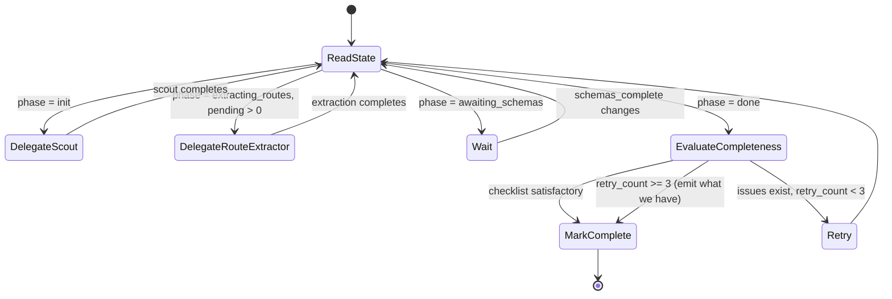

### Tools

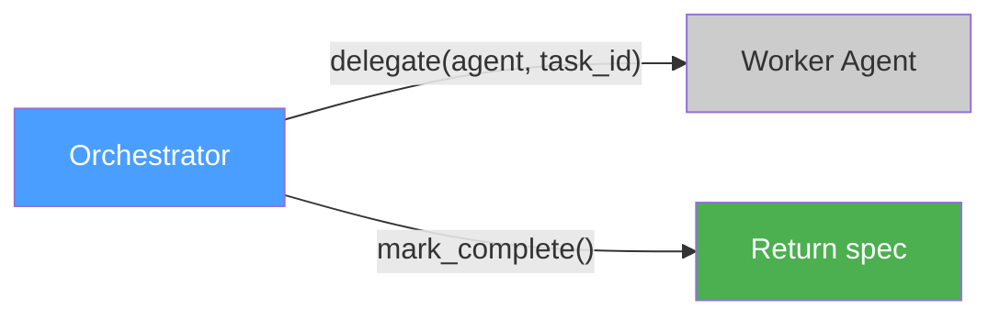

| Tool | Signature | Purpose |
|------|-----------|---------|
| `delegate` | `(agent: str, task_id: str)` | Dispatch work to a named worker agent |
| `mark_complete` | `()` | Signal that the spec is finished |

### Injected State

The orchestrator receives this from the State Producer at the start of every turn. It is the **only input** the orchestrator sees besides its own conversation history.

```json
{
  "phase": "init | extracting_routes | awaiting_schemas | done",
  "framework": "fastapi",
  "routes": {
    "total": 5,
    "extracted": 3,
    "pending": ["comments.py", "tags.py"]
  },
  "schemas_complete": false,
  "completeness": {
    "has_endpoints": true,
    "has_security_schemes": true,
    "endpoints_have_auth": true,
    "has_error_responses": true,
    "has_request_bodies": true,
    "has_schemas": false,
    "no_unresolved_refs": false,
    "has_servers": true,
    "route_coverage": 0.6
  },
  "validation_errors_summary": "2 errors: missing $ref CommentResponse, duplicate operationId",
  "retry_count": 0
}
```

### Context Accumulation

| Source | Size | Growth |
|--------|------|--------|
| State summary | ~500B | Constant (refreshed each turn) |
| Conversation history (own decisions) | ~200 tok/turn | Linear with route count |

**Mitigation for large codebases**: Infrastructure replaces old delegation history with a summary (e.g., "28 of 30 routes extracted successfully") to keep context bounded.

### What It Never Sees

- Source code
- Artifact contents (endpoint descriptors, schema descriptors)
- Full validation output
- File paths beyond what's in the pending list

### Decision Rules

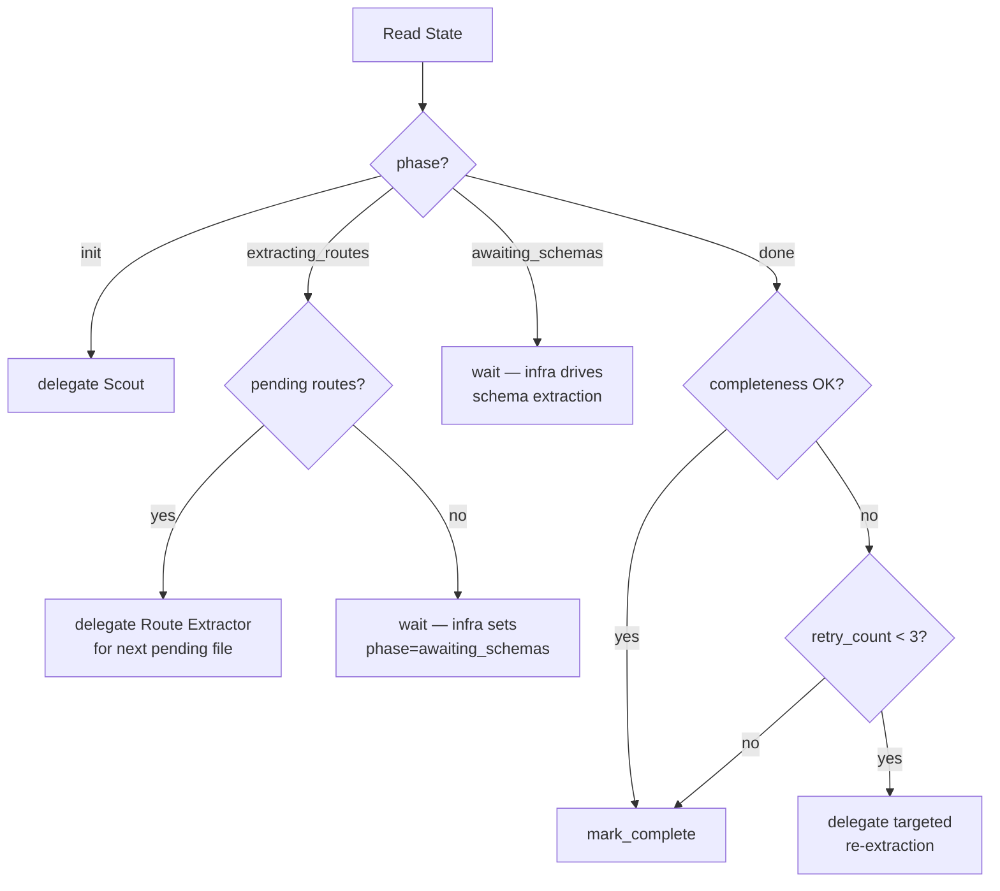

---

## Scout Agent

The explorer. Scans the project structure to produce a discovery manifest. Runs exactly once. Uses an internal working state to accumulate findings across many tool calls without losing information.

The Scout is intentionally minimal — it identifies the framework, route files, and server config. Security schemes, error models, model files, and dependency graphs are discovered downstream by the Route Extractor and infrastructure.

### Behavior

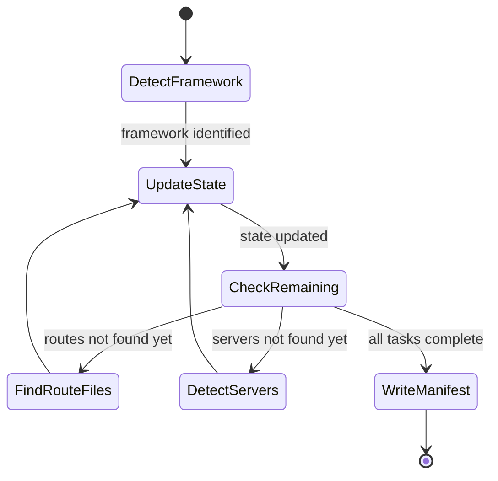

### Stateless Turn Architecture

The Scout uses **no conversation history**. The harness rebuilds the prompt from three state layers at every turn. This keeps context bounded regardless of how many files are explored across dozens of tool calls.

#### Layer 1: Deterministic Trace (harness-managed, append-only)

Auto-built from tool calls. The LLM never writes to this layer.

```json
{
  "turn_count": 7,
  "tool_history": [
    {"turn": 1, "tool": "glob", "args": "**/*.py", "summary": "47 files matched"},
    {"turn": 2, "tool": "read_file_head", "args": "app/main.py:30", "summary": "30 lines read"},
    {"turn": 3, "tool": "grep", "args": "pattern=@app.route, path=.", "summary": "12 matches in 5 files"}
  ],
  "files_touched": ["app/main.py", "app/routes/users.py", "app/core/security.py"]
}
```

The harness generates `summary` deterministically from tool results (file count from glob, line count from read, match count from grep). This gives the agent awareness of what it already explored without needing conversation history.

#### Layer 2: Scratchpad (LLM-managed, full rewrite each turn)

Markdown working memory the LLM **regenerates entirely** via `update_scratchpad` at the start of each turn, reflecting on the previous tool result. Not appended — fully rewritten to stay concise. Size-budgeted (~1500 tokens).

Contains:
- **Findings so far** — partial results, hypotheses
- **Open questions** — "saw `get_current_user` dependency but haven't traced where the scheme is defined"
- **Next steps** — what to do on the next turn
- **Key context** — snippets, import patterns, anything needed for upcoming decisions

The scratchpad replaces conversation history as the agent's "thinking" memory. The deterministic trace acts as a safety net — file-level facts (what was explored) are never lost even if the scratchpad omits them.

#### Layer 3: Structured Findings (LLM-managed, accumulating)

The actual discoveries, updated via `update_state`. Lists append (deduped), scalars overwrite. Validated against a known schema.

```json
{
  "framework": null,
  "language": null,
  "route_files": [],
  "servers": [],
  "base_path": "",
  "remaining_tasks": [
    "identify_framework",
    "find_route_files",
    "find_servers"
  ]
}
```

`remaining_tasks` is a predefined checklist. The LLM checks items off via `update_state`. The harness tracks completion.

#### Turn Cycle

```
┌──────────────────────────────────────────────────────┐
│ Harness builds prompt (deterministic):               │
│  1. System prompt (static)                           │
│  2. Deterministic trace (auto-built, append-only)    │
│  3. Previous scratchpad (LLM-written last turn)      │
│  4. Structured findings (accumulated)                │
│  5. Remaining tasks checklist                        │
│  6. Latest tool result (raw output from last action) │
└────────────────────┬─────────────────────────────────┘
                     ▼
┌──────────────────────────────────────────────────────┐
│ LLM inference (single call) emits:                   │
│  a. update_scratchpad — reflects on last observation │
│  b. Tool call — next action (glob/grep/read/etc.)    │
│  c. Optionally: update_state — merge new findings    │
└────────────────────┬─────────────────────────────────┘
                     ▼
┌──────────────────────────────────────────────────────┐
│ Harness processes (deterministic):                   │
│  - Replaces scratchpad with new version              │
│  - Merges any update_state into structured findings  │
│  - Executes tool call                                │
│  - Appends tool summary to deterministic trace       │
│  - Loops back (rebuild prompt for next turn)         │
└──────────────────────────────────────────────────────┘
```

The scratchpad reflects on the **previous** tool result (which was just injected), then the agent picks its next action. This is the standard ReAct pattern: Think (scratchpad) → Act (tool call) → Observe (injected next turn).

#### Termination

Two mechanisms:
- **Normal:** The LLM calls `write_artifact` when `remaining_tasks` is empty. The harness ignores the LLM-provided data and builds the manifest from the accumulated structured state via `state_to_manifest()` — no lossy summarization step, and no risk of the LLM inventing data that wasn't in the state.
- **Safety net:** The harness enforces a max turn count. If reached, it builds the manifest from whatever state exists.

#### Why No Conversation History

| Approach | Context growth | Risk |
|----------|---------------|------|
| Full conversation history | O(turns × tool_output_size) | Balloons to 100K+ tokens on large codebases |
| Three-layer state | O(findings + trace_summary) | Bounded ~5-10KB regardless of turns |

The structured findings capture *what was discovered*. The deterministic trace captures *what was explored*. The scratchpad captures *what the agent is thinking*. Together they replace the full conversation log.

**The state is purely internal.** It exists only during the Scout's single invocation. It is not persisted, not shared with other agents, and not visible to infrastructure. Only the final `discovery_manifest` artifact crosses the boundary.

### Tools

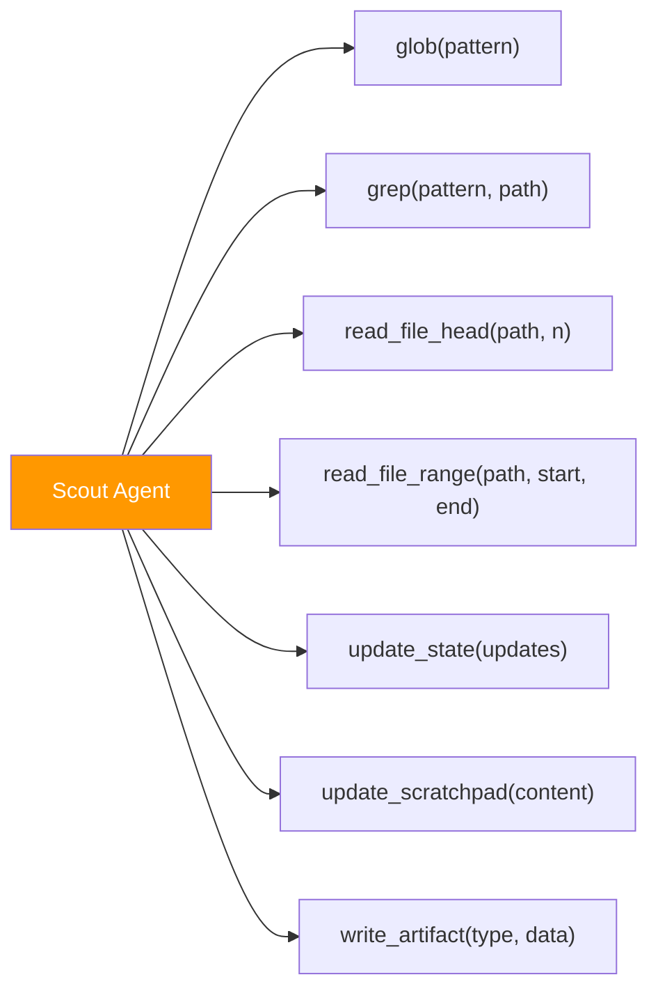

| Tool | Signature | Purpose | Context cost |
|------|-----------|---------|-------------|
| `glob` | `(pattern: str)` | Find files matching a pattern | ~50B per result |
| `grep` | `(pattern: str, path: str)` | Search for code patterns | ~100B per match |
| `read_file_head` | `(path: str, n_lines: int)` | Read first N lines (imports, decorators) | ~50B × n_lines |
| `read_file_range` | `(path: str, start: int, end: int)` | Read specific line range (config blocks) | ~50B × line count |
| `update_state` | `(updates: dict)` | Merge findings into structured state, check off remaining_tasks | N/A (state mutation) |
| `update_scratchpad` | `(content: str)` | Full rewrite of the markdown scratchpad — reflects on last observation, records insights and next steps (~1500 token budget) | N/A (state mutation) |
| `write_artifact` | `(type: "discovery_manifest", data: dict)` | Signal completion — harness builds manifest from accumulated state | N/A (output) |

**No `read_file` (full file).** The Scout reads selectively to stay within context budget.

### Injected Context (rebuilt each turn by harness)

```json
{
  "target_directory": "/path/to/project",
  "deterministic_trace": {
    "turn_count": 7,
    "tool_history": ["...see Layer 1 above..."],
    "files_touched": ["..."]
  },
  "scratchpad": "...LLM's previous scratchpad (markdown)...",
  "structured_findings": { "...see Layer 3 above..." },
  "remaining_tasks": ["find_servers"],
  "last_tool_result": "...raw output from the previous tool call..."
}
```

On the first turn, `deterministic_trace` is empty, `scratchpad` is empty, `structured_findings` has all nulls/empty lists, and `remaining_tasks` has all 3 items. Each subsequent turn reflects all accumulated state.

### Context Accumulation

| Source | Size | Growth |
|--------|------|--------|
| System prompt | ~1.5KB | Constant |
| Deterministic trace | ~50B × turn count | Linear but compact (summaries only) |
| Scratchpad | ~1.5KB max | Constant (full rewrite, size-budgeted) |
| Structured findings | ~0.5-1KB | Grows with route file count, bounded |
| Last tool result | ~0.5-5KB | Per-step, not accumulated |
| **Total per turn** | **~4-10KB** | **Bounded regardless of turn count** |

No conversation history. The three state layers fully replace it. Old tool results (glob listings, grep matches, file snippets) are not retained — their insights are captured in the scratchpad and findings.

### Output Artifact: `discovery_manifest`

```json
{
  "framework": "fastapi | express | nestjs | spring",
  "language": "python | typescript | java",
  "route_files": [
    "app/api/routes/users.py",
    "app/api/routes/articles.py"
  ],
  "servers": [
    "http://localhost:8000"
  ],
  "base_path": "/api"
}
```

### Exploration Strategy

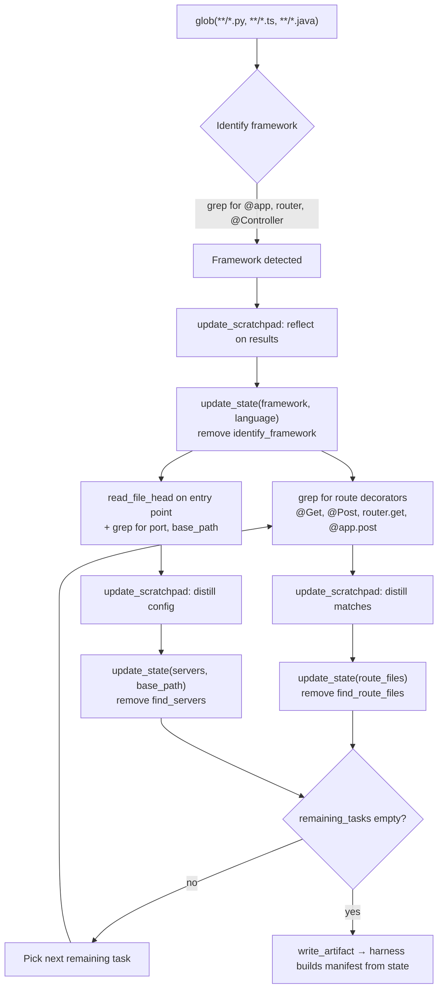

At each turn, the LLM first calls `update_scratchpad` to reflect on the previous tool result (distilling insights from raw output), then calls `update_state` to merge structured findings, then picks the next action based on `remaining_tasks`. The scratchpad ensures no insight is lost between turns even though raw tool results are discarded.

---

## Route Extractor Agent

The endpoint analyst. Reads exactly one route file per invocation. Stateless — no memory of previous extractions. Captures import lines alongside type names to enable deterministic ref resolution by infrastructure.

### Behavior

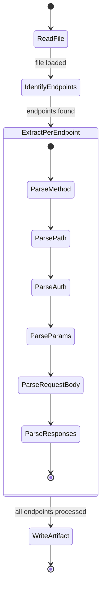

### Tools

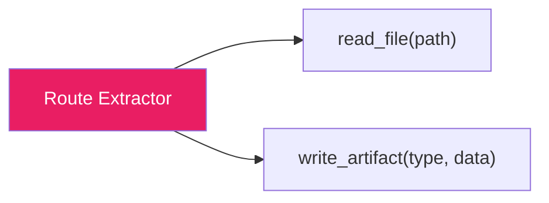

| Tool | Signature | Purpose | Context cost |
|------|-----------|---------|-------------|
| `read_file` | `(path: str)` | Read the single assigned route file | File size (2-10KB typical) |
| `write_artifact` | `(type: "endpoint_descriptor", data: dict)` | Output extracted endpoints | N/A (output) |

**Cannot** glob, grep, or explore. Two tools only.

### Injected Context

Prepared by the Context Preparer — a filtered subset of the discovery manifest.

```json
{
  "framework": "fastapi",
  "base_path": "/api",
  "target_file": "app/api/routes/users.py"
}
```

~150 bytes. The agent knows the framework (so it knows what decorators/patterns to look for) and the base path (so it can build full paths). Security schemes and error models are discovered directly from the route file's code — auth middleware, decorators, error handling patterns, and import lines.

### Context Accumulation

| Source | Size | Growth |
|--------|------|--------|
| Injected context | ~300B | Constant |
| Route file content | 2-10KB | Single file, constant |
| Agent reasoning | ~1-2KB | Constant (one-shot) |
| **Total per invocation** | **~12KB max** | **None — stateless** |

No accumulation. Each invocation is independent and discarded after producing its artifact.

### Output Artifact: `endpoint_descriptor`

Each schema reference is a `ref_hint` object with three fields:
- `ref_hint` — the type name as it appears in code
- `import_source` — the raw import line (if found), or `null`
- `resolution` — `"import"` (has import line), `"class_to_file"` (no import, use name lookup), or `"unresolvable"` (external package, dynamic, or untyped)

```json
{
  "source_file": "app/api/routes/users.py",
  "endpoints": [
    {
      "method": "POST",
      "path": "/api/users",
      "operation_id": "create_user",
      "auth": null,
      "request_body": {
        "content_type": "application/json",
        "ref_hint": "NewUserRequest",
        "import_source": "from app.schemas.user import NewUserRequest",
        "resolution": "import"
      },
      "responses": {
        "200": {
          "ref_hint": "UserResponse",
          "import_source": "from app.schemas.user import UserResponse",
          "resolution": "import"
        },
        "422": {
          "ref_hint": "ValidationError",
          "import_source": null,
          "resolution": "class_to_file"
        }
      },
      "parameters": [],
      "tags": ["Users"]
    },
    {
      "method": "POST",
      "path": "/api/users/login",
      "operation_id": "login_user",
      "auth": null,
      "request_body": {
        "content_type": "application/json",
        "ref_hint": "LoginRequest",
        "import_source": "from app.schemas.user import LoginRequest",
        "resolution": "import"
      },
      "responses": {
        "200": {
          "ref_hint": "UserResponse",
          "import_source": "from app.schemas.user import UserResponse",
          "resolution": "import"
        },
        "401": {
          "ref_hint": "GenericError",
          "import_source": "from app.core.errors import GenericError",
          "resolution": "import"
        },
        "422": {
          "ref_hint": "ValidationError",
          "import_source": null,
          "resolution": "class_to_file"
        }
      },
      "parameters": [],
      "tags": ["Users"]
    },
    {
      "method": "GET",
      "path": "/api/user",
      "operation_id": "get_current_user",
      "auth": "BearerAuth",
      "request_body": null,
      "responses": {
        "200": {
          "ref_hint": "UserResponse",
          "import_source": "from app.schemas.user import UserResponse",
          "resolution": "import"
        },
        "401": {
          "ref_hint": "GenericError",
          "import_source": "from app.core.errors import GenericError",
          "resolution": "import"
        }
      },
      "parameters": [],
      "tags": ["Users"]
    },
    {
      "method": "PUT",
      "path": "/api/user",
      "operation_id": "update_current_user",
      "auth": "BearerAuth",
      "request_body": {
        "content_type": "application/json",
        "ref_hint": "UpdateUserRequest",
        "import_source": "from app.schemas.user import UpdateUserRequest",
        "resolution": "import"
      },
      "responses": {
        "200": {
          "ref_hint": "UserResponse",
          "import_source": "from app.schemas.user import UserResponse",
          "resolution": "import"
        },
        "401": {
          "ref_hint": "GenericError",
          "import_source": "from app.core.errors import GenericError",
          "resolution": "import"
        },
        "422": {
          "ref_hint": "ValidationError",
          "import_source": null,
          "resolution": "class_to_file"
        }
      },
      "parameters": [],
      "tags": ["Users"]
    }
  ]
}
```

**Note on `resolution: "unresolvable"`:** Used when the Route Extractor identifies a return type but cannot resolve it — external packages (`from fastapi.responses import StreamingResponse`), dynamic types, or handlers with no type annotation (`-> dict`). Example:

```json
{
  "ref_hint": "StreamingResponse",
  "import_source": "from fastapi.responses import StreamingResponse",
  "resolution": "unresolvable"
}
```

The Assembler will emit a placeholder schema with `x-unresolved: true` for these.

### What It Recognizes Per Framework

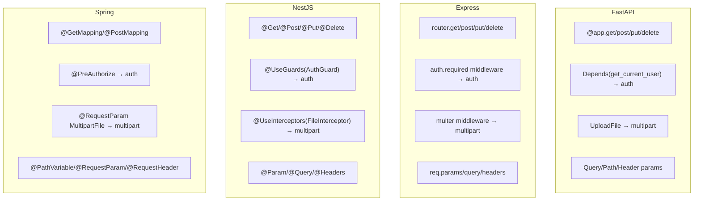

---

## Schema Extractor Agent

The model analyst. Reads exactly one model file per invocation. Receives only direct dependency schemas as context, not the full store.

### Behavior

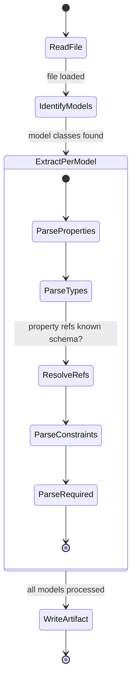

### Tools

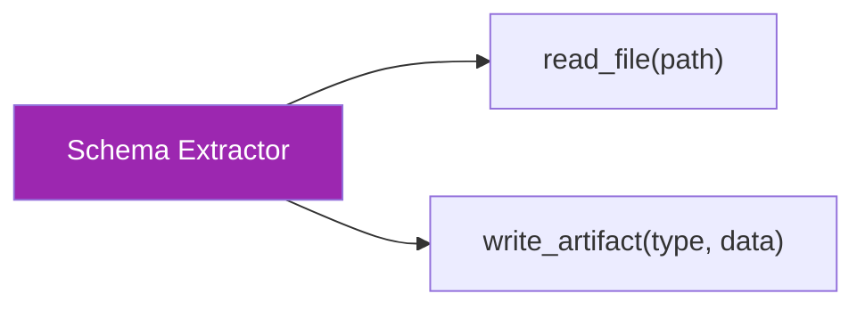

| Tool | Signature | Purpose | Context cost |
|------|-----------|---------|-------------|
| `read_file` | `(path: str)` | Read the single assigned model file | File size (1-5KB typical) |
| `write_artifact` | `(type: "schema_descriptor", data: dict)` | Output extracted schemas | N/A (output) |

**Cannot** glob, grep, or explore. Two tools only.

### Injected Context

Prepared by the Context Preparer. Contains the framework, the target file, and **only the schemas this file directly imports** (resolved from the dependency graph).

```json
{
  "framework": "fastapi",
  "target_file": "app/models/article.py",
  "known_schemas": {
    "User": {
      "type": "object",
      "properties": {
        "email": { "type": "string", "format": "email" },
        "username": { "type": "string", "minLength": 3, "maxLength": 20 },
        "bio": { "type": "string", "nullable": true },
        "image": { "type": "string", "format": "uri", "nullable": true }
      },
      "required": ["email", "username"]
    },
    "Tag": {
      "type": "object",
      "properties": {
        "name": { "type": "string" }
      },
      "required": ["name"]
    }
  }
}
```

The agent uses `known_schemas` to emit correct `$ref` pointers for properties that reference imported models, instead of guessing or inlining.

### Context Accumulation

| Source | Size | Growth |
|--------|------|--------|
| Injected context (framework + target) | ~200B | Constant |
| `known_schemas` (direct deps only) | ~500B × dep count | Direct dependency fan-in |
| Model file content | 1-5KB | Single file, constant |
| Agent reasoning | ~1-2KB | Constant (one-shot) |
| **Typical invocation** | **~5-8KB** | **None — stateless** |
| **Worst case** (10 direct deps) | **~12KB** | **Bounded by dep fan-in** |

No accumulation across invocations. Each call is independent.

### Output Artifact: `schema_descriptor`

```json
{
  "source_file": "app/models/article.py",
  "schemas": {
    "Article": {
      "type": "object",
      "properties": {
        "slug": { "type": "string" },
        "title": { "type": "string", "minLength": 1, "maxLength": 255 },
        "description": { "type": "string" },
        "body": { "type": "string" },
        "author": { "$ref": "#/components/schemas/User" },
        "tagList": {
          "type": "array",
          "items": { "$ref": "#/components/schemas/Tag" }
        },
        "favorited": { "type": "boolean" },
        "favoritesCount": { "type": "integer", "minimum": 0 },
        "createdAt": { "type": "string", "format": "date-time" },
        "updatedAt": { "type": "string", "format": "date-time" }
      },
      "required": ["slug", "title", "description", "body", "author"]
    },
    "CreateArticleRequest": {
      "type": "object",
      "properties": {
        "title": { "type": "string", "minLength": 1 },
        "description": { "type": "string", "minLength": 1 },
        "body": { "type": "string", "minLength": 1 },
        "tagList": {
          "type": "array",
          "items": { "type": "string" }
        }
      },
      "required": ["title", "description", "body"]
    }
  }
}
```

### Ref Resolution Logic

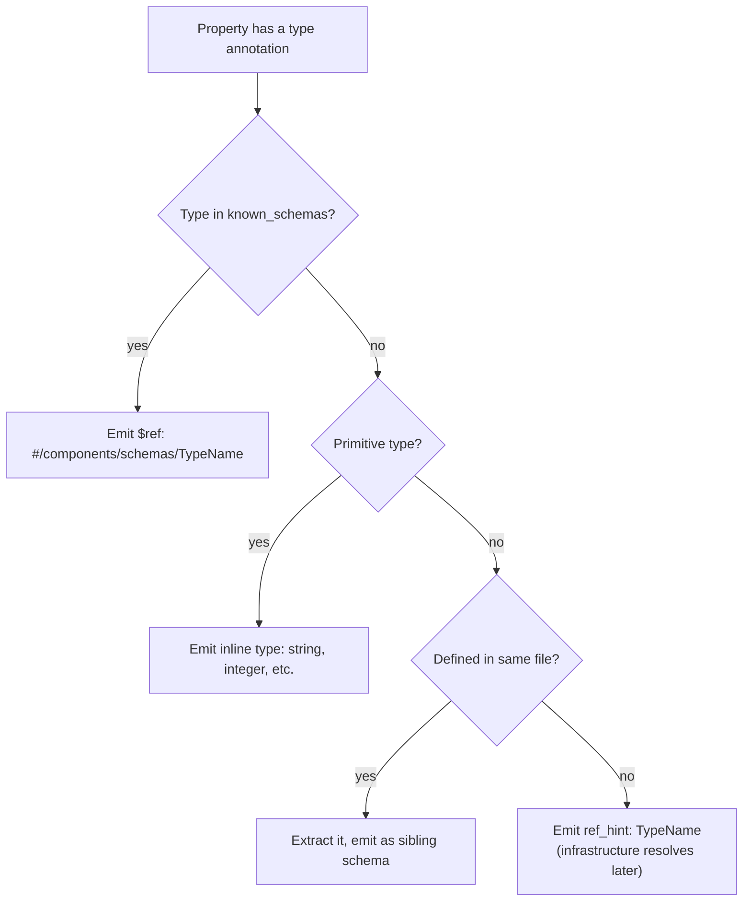

---

## Infrastructure-Driven Schema Resolution

The schema extraction loop is **not driven by any agent**. It is an infrastructure process that runs autonomously after all routes are extracted.

### Ref Hint Resolution (Two-Tier)

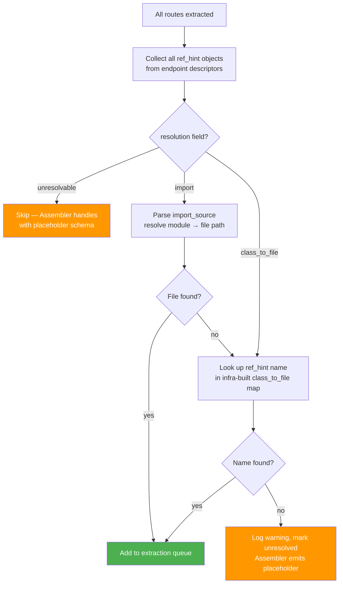

Import-path resolution is the primary mechanism — it's deterministic and doesn't depend on name matching. The `class_to_file` fallback is built by infrastructure from import lines parsed during model file resolution (not provided by the Scout). It covers same-package references and cases where the import line wasn't captured.

### Schema Extraction Loop

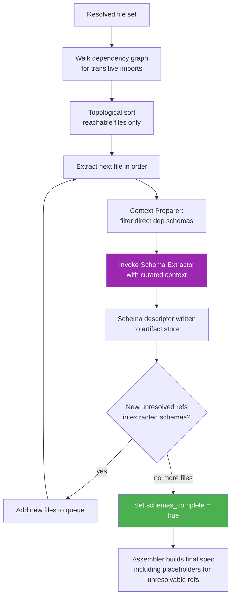

The only LLM call in this loop is the Schema Extractor invocation. Everything else — ref resolution, dependency walking, topological sorting, queue management, completion detection — is deterministic code.

### Unresolvable Ref Handling

Refs marked `"unresolvable"` or that fail both resolution tiers are never silently dropped. The Assembler emits a placeholder schema:

```yaml
StreamingResponse:
  type: object
  description: "Schema could not be resolved from source code. Type originated from: external package."
  x-unresolved: true
```

This keeps the spec structurally valid (all `$ref` targets exist) while clearly signaling to the pentester that the schema is incomplete. The `x-unresolved` extension enables automated tooling to flag these for manual review.
